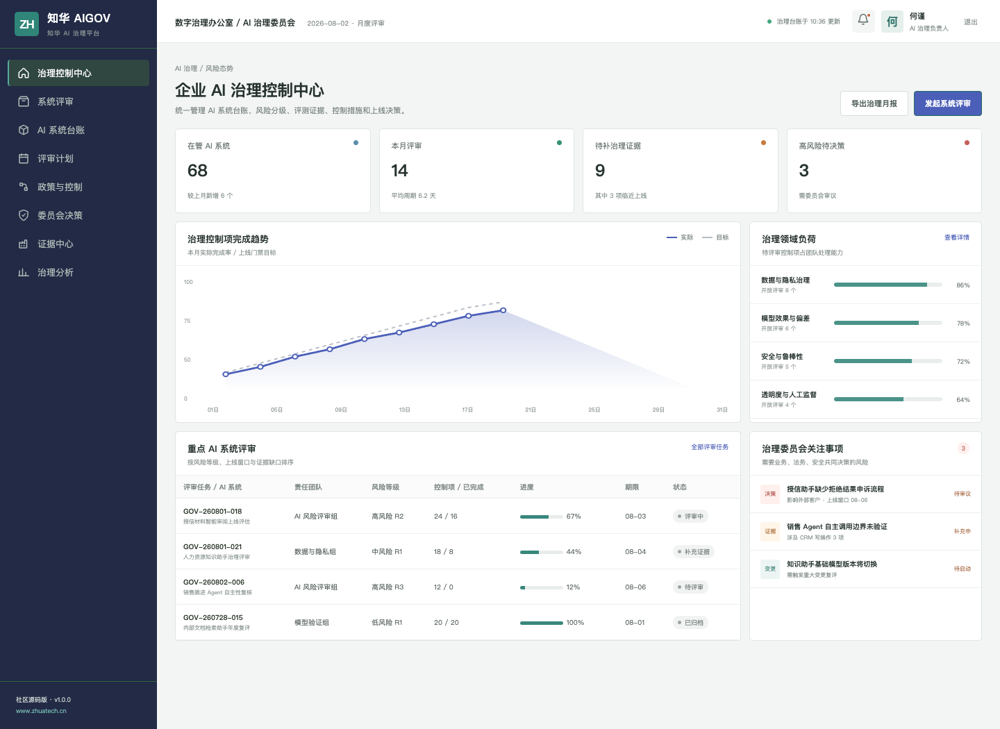
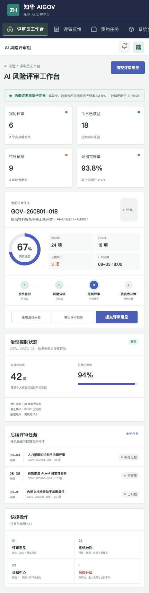

# ZhuaTech AI Governance · 知华 AI 治理平台

面向企业 AI 系统全生命周期的治理控制中心。它把系统登记、风险分级、证据评审、上线决策和运行复评放进同一条可追踪流程，而不是停留在一份静态制度文档中。

项目由 **上海如静知华信息科技有限公司（知华科技）**发布。产品与技术服务请访问[知华科技官网](https://www.zhuatech.cn/)。

   

## 为什么做这个项目

AI 项目快速增长后，企业通常会遇到三个问题：系统台账分散、风险判断缺少统一尺度、上线证据无法复用。ZhuaTech AIGOV 提供一套可运行的社区版参考实现，用具体的数据模型和流程表达治理要求。

```text
业务提出用途 → 登记模型与数据 → 自动风险初筛 → 控制与证据评审 → 上线决策 → 运行复评
```

核心能力包括 AI 系统台账、风险分级、模型卡与数据卡、评测证据、人工监督、整改闭环、委员会决策及治理指标。`POST /api/shopfloor/ai-risk-assessment` 提供一套不依赖外部模型的可解释风险评分实现。

## 真实界面

### 治理负责人：风险与决策全景



管理端以评审队列为主线，同时展示风险等级、治理领域负荷、证据缺口和委员会关注事项。

### 评审员：移动评审工作台



H5 端适合评审员查看任务、核验证据、提交意见和发起风险升级。

## 工程结构

| 目录 | 说明 |
| --- | --- |
| `backend` | Java 21、Spring Boot、Spring Security、JWT、JPA、Flyway |
| `frontend` | Vue 3、Pinia、Vue Router、Axios、Vite，兼顾桌面管理端和 H5 |
| `docs` | API、架构、数据库和界面资料 |
| `deploy` | Docker Compose 与部署说明 |

Java 工程包名为 `cn.zhuatech.aigov`，默认 MySQL 数据库为 `zhuatech_aigov`。演示数据均为虚构数据。

## 5 分钟体验

```bash
cd frontend
npm install
npm run dev:demo
```

打开 `http://localhost:5173`。治理端使用 `planner / Demo@2026`，评审端使用 `operator / Demo@2026`。完整 API 与容器启动方式见 [API 文档](docs/api.md)和[部署说明](deploy/README.md)。

## 使用边界

本工程仅允许用于个人学习、研究及非商业技术交流，**不得商用**。企业内部使用、生产部署、SaaS 服务、客户项目交付、收费培训、咨询实施、品牌替换或商业分发，均需事先取得上海如静知华信息科技有限公司书面授权。详细条款以 [LICENSE](LICENSE) 为准。

如需 AI 治理制度落地、平台集成、私有化部署或深度开发定制，可访问[知华科技官网](https://www.zhuatech.cn/)或扫码咨询：

| AI 治理咨询 | 深度定制咨询 |
| --- | --- |
|  |  |

SEO：AI 治理平台、AI Governance、模型风险管理、AI 系统台账、算法治理、Java AI 治理源码、Vue 管理系统、知华科技。

## 人工监督就绪度

新增 `POST /api/aigov/insights/human-oversight-readiness`。面向高影响 AI 场景，检查人工复核、可解释性、持续监控、回滚机制和责任人配置，形成监督完备度评分并返回 `APPROVE`、`REVIEW` 或 `BLOCK`，用于上线评审和治理证据留存。
